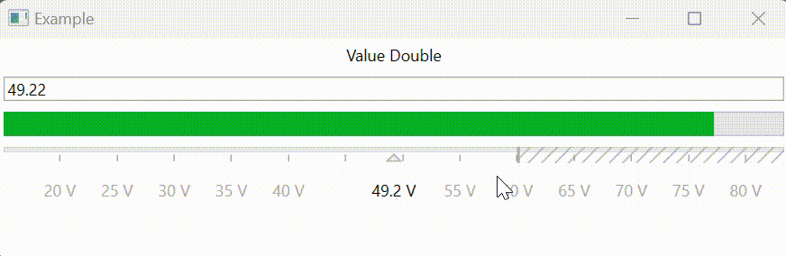

[![Contributors][contributors-shield]][contributors-url]
[![Forks][forks-shield]][forks-url]
[![Stargazers][stars-shield]][stars-url]
[![Issues][issues-shield]][issues-url]
[![MIT License][license-shield]][license-url]

<div align="center">
    
</div>

## About Fine Slider

This is a simple user control inspired by the control knob on analog devices. Can be controlled by mouse or touch screen. Allows you to natively and accurately set the value.



Some features:
* Open source
* Built-in converter of physical values
* Controlled by mouse and touchscreen
* Similar to native windows design
* Does not use third party libraries

This is an easy quick project to manage physical numbers. It is under development.

### Installation

Just use nuget

## Usage

To use it, you need to insert a XAML element.
Normally, you should bind the `Value` parameter to the `double` variable. Optionally, you can specify limits for the scale.
* `Minimum` - **double** | Restriction for setting by the user. Less than this value, the user will not be able to set.
* `Maximum` - **double** | Restriction for setting by the user. The user will not be able to set more than this value.
* `Unit` - **string** | Text parameter - naming units
* `Span` - **double** | Sweep value for visible range.
* `MinimumSpan` - **double** | User setting limit (when zooming).
* `MaximumSpan` - **double** | User setting limit (when zooming).
```xaml
<fs:FineSlider Value="{Binding ValueDouble}" Minimum="-60" Maximum="60"
               Unit="V" Span="0.1" MinimumSpan="0.01" MaximumSpan="100"/>
```
Don't forget to add the library to the list:
```xaml
<Window x:Class="Example.MainWindow"
        ...
        xmlns:fs="clr-namespace:FineSliderNet;assembly=FineSliderNet"
        ...
```
## License

Distributed under the MIT License. See `LICENSE` for more information.

<!-- https://www.markdownguide.org/basic-syntax/#reference-style-links -->
[contributors-shield]: https://img.shields.io/github/contributors/himaniman/fineslider.net.svg?style=for-the-badge
[contributors-url]: https://github.com/himaniman/fineslider.net/graphs/contributors
[forks-shield]: https://img.shields.io/github/forks/himaniman/fineslider.net.svg?style=for-the-badge
[forks-url]: https://github.com/himaniman/fineslider.net/network/members
[stars-shield]: https://img.shields.io/github/stars/himaniman/fineslider.net.svg?style=for-the-badge
[stars-url]: https://github.com/himaniman/fineslider.net/stargazers
[issues-shield]: https://img.shields.io/github/issues/himaniman/fineslider.net.svg?style=for-the-badge
[issues-url]: https://github.com/himaniman/fineslider.net/issues
[license-shield]: https://img.shields.io/github/license/himaniman/fineslider.net.svg?style=for-the-badge
[license-url]: https://github.com/himaniman/fineslider.net/blob/master/LICENSE